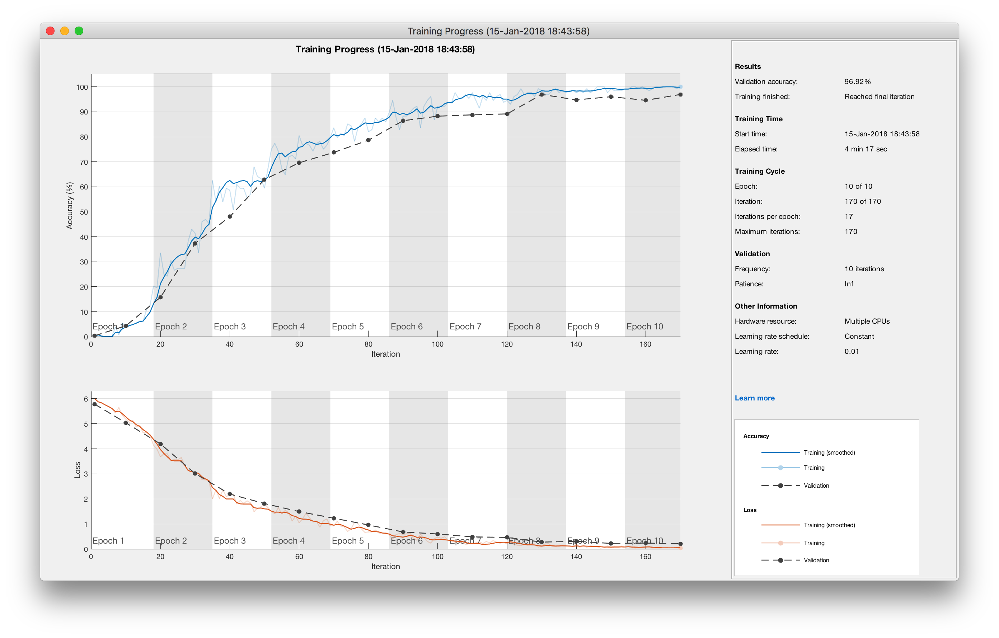
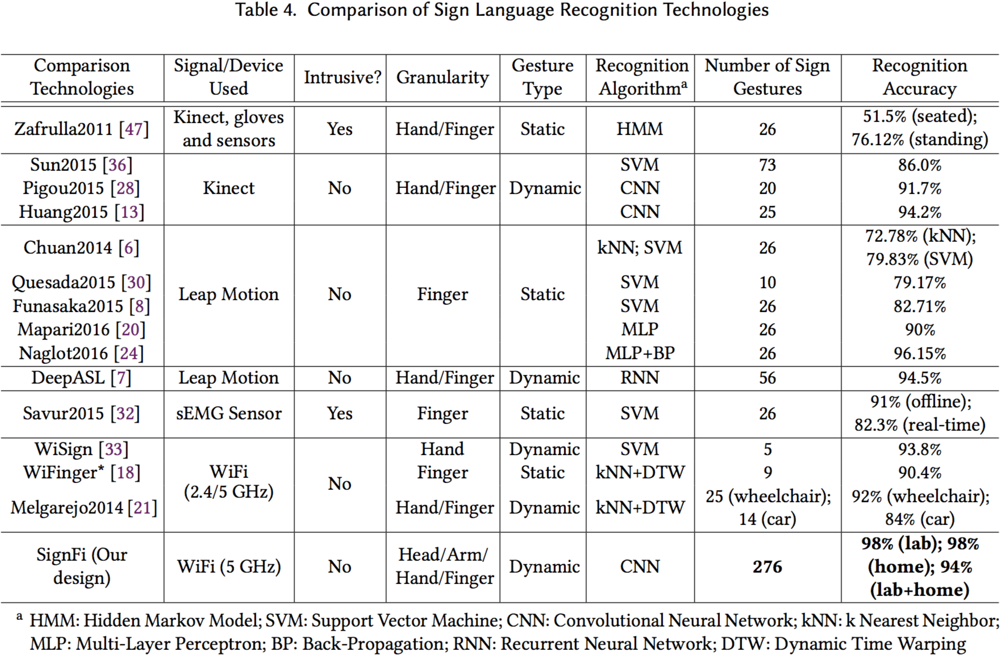

This website contains datasets of Channel State Information (CSI) traces for sign language recognition using WiFi.

## Cite the Paper
> Yongsen Ma, Gang Zhou, Shuangquan Wang, Hongyang Zhao, and Woosub Jung. 2018. SignFi: Sign Language Recognition Using WiFi. Proc. ACM Interact. Mob. Wearable Ubiquitous Technol. 2, 1, Article 23 (March 2018), 21 pages. DOI: [https://doi.org/10.1145/3191755](https://doi.org/10.1145/3191755)

Readers can also check the following paper for more details about WiFi sensing with Channel State Information.
> Yongsen Ma, Gang Zhou, and Shuangquan Wang. 2019. WiFi Sensing with Channel State Information: A Survey. ACM Comput. Surv. 52, 3, Article 46 (June 2019), 36 pages. DOI: [https://doi.org/10.1145/3310194](https://doi.org/10.1145/3310194)


## Files
This repository contains the following files. You agree to the [Terms of Use for SignFi Dataset](#terms-of-use-for-signfi-dataset) to download and use the files.

| Files | Description | Size |
| ----- | ----------- | ---- |
| [dataset_lab_276_dl.mat](https://wm1693.box.com/s/z9vsrn3998n4xyzkpqtj89yclk28eatp) | Segmented downlink CSI traces and ground truth labels for 276 sign words in the lab environment. There are 5,520 instances of 276 sign gestures performed by one user.| 1.44GB |
| [dataset_lab_276_ul.mat](https://wm1693.box.com/s/5hr4u7lsj10c329oibp8fjv95i524tnl) | Segmented uplink CSI traces and ground truth labels for 276 sign words in the lab environment. There are 5,520 instances of 276 sign gestures performed by one user.| 1.33GB |
| [dataset_home_276.mat](https://wm1693.box.com/s/mmikgi9ubkg7vnwaztplnxudh8sgj1np) | Segmented downlink and uplink CSI traces and ground truth labels for 276 sign words in the home environment. There are 2,760 instances of 276 sign gestures performed by one user. | 1.37GB |
| [dataset_lab_150.mat](https://wm1693.box.com/s/kidoq54rv93ysojgzv7xjqixyzwir7lq) | Segmented downlink CSI traces and ground truth labels for 150 sign words in the lab environment. There are 7,500 instances of 150 sign gestures performed by five users. | 1.93GB |
| [signfi_cnn_example.m](https://wm1693.box.com/s/pvlrxb7cxexgfquyt1dqn52a49kz90db) | MATLAB source code for training and testing using the dataset. | 3KB |
| [training_screen_shot.png](https://wm1693.box.com/s/4vkpfzet9cctpya8pcjorq646adomboe) | A screen shot of the training process | 541KB |
| [sign_labels.csv](https://wm1693.box.com/s/wu3bvgbuzbypfvsq716qqgynpw8qriiy) | 276 sign words used in the measurement. | 2KB |
| [videos/](https://wm1693.box.com/s/ptdahj91p3uaxm49fz24b398xxzu7yl7) | This folder contains the videos for 276 basic sign words. These videos are used for the participant to learn and perform sign gestures during data collection. | 105.9MB |
| [README.md](https://wm1693.box.com/s/jx4t4aeg5gm3xhnh8v5ooj7cr6qb3xgv) | Readme | 5KB |

Both downlink and uplink CSI traces are included for the 276 sign words in the lab and home environments. Only downlink CSI traces are used in the paper. CSI traces are collected using the <a href="http://dhalperi.github.io/linux-80211n-csitool/" target="_blank">802.11n CSI Tool</a>. Please check the paper for more details about experiment setup, measurement procedure, WiFi settings, etc.


## An Example
The following shows an example of how to train the dataset. Load the dataset `csid_lab` and `label_lab` into the Matlab workspace by running `load('dataset_lab_276_dl.mat');`. Run `[net_info, perf] = signfi_cnn_example(csid_lab,label_lab);` to train the neural network and get recognition results. This shows the training process in the following figure.


The following shows how `signfi_cnn_example` works.
1. Prepare data for training.
```matlab
tic; % starting time
csi_abs = abs(csi); % CSI amplitude
csi_ang = angle(csi); % CSI phase
csi_tensor = [csi_abs,csi_ang];
word = categorical(label);
t0 = toc; % pre-processing time
```
`tic` and `toc` are used to measure time consumption. The size of `csid_lab` is `size(csid_lab)=(200,30,3,5520)`. `csi_tensor` and `word` are the CSI input and labels. (Optional) Remove phase offset before feeding to neural network models. A reference of the code for removing phase offset can be found at [csi_phase_offset.py](./csi_phase_offset.py).
```python
from scipy.optimize import curve_fit
idx_tx_subc = np.zeros(shape=(2, 3, 3, 30)) # placeholder for curve fitting
for tx in range(3):         # tx index
    for rx in range(3):     # rx index
        for k in range(30): # subcarrier index
            idx_tx_subc[0, tx, rx, k] = (tx+2)/3 - 2 # tx index, reordered
            idx_tx_subc[1, tx, rx, k] = -58 + 4*k # subcarrier index
idx_tx_subc = np.reshape(idx_tx_subc, (2, 270))
```
```python
def func(x, a, b, c): # Phase offsets function
    return a*x[0] *x[1] + b*x[1] + c # x[0]: transmit antenna index, x[1]: subcarrier index
```
```python
def remove_phase_offset(csi):
    csi = np.array(csi)
    csi_shape = csi.shape
    csi_abs = np.abs(csi)
    csi_ang = np.angle(csi)
    phase = csi_ang[0, ...] # get phase offsets from the 1st packet
    for tx in range(csi_shape[1]): # tx
        for rx in range(csi_shape[2]): # rx
            phase[tx, rx, :] = unwrap(phase[tx, rx, :])
    phase = phase. flatten()
    popt, pcov = curve_fit(func, idx_tx_subc, phase)
    phase = func(idx_tx_subc, *popt)
    phase = np.reshape(phase, (csi_shape(1),csi_shape [ 2 ], csi_shape [3]))
    pdp = np.zeros(shape=csi_shape, dtype=np.complex)
    for t in range (csi_shape[0]): # time
        for tx in range(csi_shape[1]): # tx
            for rx in range(csi_shape[2]): # rx
                csi_ang[t, tx, rx, :] = unwrap(csi_ang[t, tx, rx, :])
                csi_ang[t, tx, rx, :] -= phase[tx, rx, :]
                csi_new = csi_abs[t, tx, rx, : ]*np.exp(1j*csi_ang[t, tx, rx, :])
                pdp[t, tx,rx, :] = np.fft.ifft(csi_new)
    return csi_abs, csi_ang, pdp
```

2. Some parameter settings.
```matlab
% [M,N,S]: CSI matrix for each instance
% T: the total number of instances
[M,N,S,T] = size(csi_tensor);
Nw = 276; % number of classes
rng(42); % For reproducibility
n_epoch = 10;
learn_rate = 0.01;
l2_factor = 0.01;
```

3. Divide the dataset into training and testing subsets.
```matlab
K = 5;
cv = cvpartition(T,'kfold',K); % 20% for testing
k = 1; % for k=1:K
trainIdx = find(training(cv,k));
testIdx = find(test(cv,k));
trainCsi = csi_tensor(:,:,:,trainIdx);
trainWord = word(trainIdx,1);
testCsi = csi_tensor(:,:,:,testIdx);
testWord = word(testIdx,1);
valData = {testCsi,testWord};
```

4. Set neural network layers and training options. MATLAB 2017b or newer versions are needed to use `batchNormalizationLayer()` for network layers and `ValidationData` for training options. For `trainingOptions()`, `'ExecutionEnvironmnet'` can be `'cpu'`, `'gpu'`, or `'parallel'`.
```matlab
% Neural network layer settings
layers = [imageInputLayer([M N S]);
          convolution2dLayer(4,4,'Padding',0);
          batchNormalizationLayer();
          reluLayer();
          maxPooling2dLayer(4,'Stride',4); 
          fullyConnectedLayer(Nw);
          softmaxLayer();
          classificationLayer()];
% Neural network training options
options = trainingOptions('sgdm','ExecutionEnvironment','cpu',...
                          'MaxEpochs',n_epoch,...
                          'InitialLearnRate',learn_rate,...
                          'L2Regularization',l2_factor,...
                          'ValidationData',valData,...
                          'ValidationFrequency',10,...
                          'ValidationPatience',Inf,...
                          'Shuffle','every-epoch',...
                          'Verbose',false,...
                          'Plots','training-progress');
```
5. Train and test the neural network; calculate recognition accuracy.
```matlab
[trainedNet,tr{k,1}] = trainNetwork(trainCsi,trainWord,layers,options);
t1 = toc; % training end time
[YTest, scores] = classify(trainedNet,testCsi);
TTest = testWord;
test_accuracy = sum(YTest == TTest)/numel(TTest);
t2 = toc; % testing end time
net_info = tr;
perf = test_accuracy;
```

6. Plot the confusion matrix. Since there are too many classes, it is not reasonable to plot the whole confusion matrix. You can divide the classes into different categories and then plot the confusion matrix.
```matlab
% plot confusion matrix
ttest = dummyvar(double(TTest))';
tpredict = dummyvar(double(YTest))';
[c,cm,ind,per] = confusion(ttest,tpredict);
plotconfusion(ttest,tpredict);
```

A comparision of sign language recognition technologies is shown in the following figure.



## Terms of Use for SignFi Dataset

You need to read and agree to the following terms of use to download and use the SignFi dataset.

>`1. Definitions`
>
>The following terms, unless the context requires otherwise, have the following meanings:
>
>“Data Team”: means the employees and students at the College of William and Mary who are working on the SignFi dataset;
>
>“SignFi Dataset”: means the channel state information traces collected by the Data Team;
>
>“Licensee”, “You”, “Your”, “Yours”: means the person or entity acquiring a license hereunder for access to and use of the SignFi Dataset.

>
>`2. Grant of License`
>
>The College of William and Mary hereby grants to You a non-exclusive, non-transferable, revocable license to use the SignFi Dataset solely for Your non-commercial, educational, and research purposes only, but without any right to copy or reproduce, publish or otherwise make available to the public or communicate to the public, sell, rent or lend the whole or any constituent part of the SignFi Dataset thereof. The SignFi Dataset shall not be redistributed without the express written prior approval of the College of William and Mary You agree to respect the privacy of those human subjects whose sign gesture data are included in the SignFi Dataset. Do not attempt to reverse the anonymization process to identify specific identifiers including, without limitation, names, postal address information, telephone numbers, e-mail addresses, social security numbers, and biometric identifiers. You agree not to reverse engineer, separate or otherwise tamper with the SignFi Dataset so that data can be extracted and used outside the scope of that permitted in this Agreement.
>
>You agree to acknowledge the source of the SignFi Dataset in all of Your publications and presentations based wholly or in part on the SignFi Dataset. You agree to provide a disclaimer in any publication or presentation to the effect that the College of William and Mary does not bear any responsibility for Your analysis or interpretation of SignFi Dataset.
>
>You agree and acknowledge that the College of William and Mary may hold, process, and store any personal data submitted by You for validation and statistical purposes and for the purposes of the administration and management of SignFi Dataset. You agree that any personal data submitted by You is accurate to the best of his or her knowledge.
>
>The College of William and Mary provides the SignFi Dataset "AS IS," without any warranty or promise of technical support, and disclaims any liability of any kind for any damages whatsoever resulting from use of the SignFi Dataset .
>
>THE COLLLEGE OF WILLIAM AND MARY MAKES NO WARRANTIES, EXPRESS OR IMPLIED WITH RESPECT TO THE SIGNFI DATASET, INCLUDING ANY IMPLIED WARRANTY OF MERCHANTABILITY OR FITNESS FOR A PARTICULAR PURPOSE, WHICH ARE HEREBY EXPRESSLY DISCLAIMED.
>
>Your acceptance and use of the SignFi Dataset binds you to the terms and conditions of this License as stated herein.
